# Frontend – Gestion de Stock Pro (Next.js)

Interface utilisateur moderne et réactive pour la gestion de stock, construite avec **Next.js 14** (App Router), **React**, **TypeScript**, et **Tailwind CSS**. Fournit des tableaux de bord, des workflows CRUD complets, la numérisation de codes-barres, et l'upload de fichiers.

---

## 📋 Table des Matières

- [Aperçu (captures d'écran)](#-aperçu-captures-décran)
- [Fonctionnalités](#-fonctionnalités)
- [Technologies](#-technologies)
- [Prérequis](#-prérequis)
- [Installation](#-installation)
- [Configuration](#-configuration)
- [Développement](#-développement)
- [Déploiement](#-déploiement)
- [Structure du Projet](#-structure-du-projet)
- [Gestion d'État](#-gestion-détat)
- [Authentification](#-authentification)
- [Troubleshooting](#-troubleshooting)

---

## 📸 Aperçu (captures d'écran)

Aperçu de l'interface **Gestion de Stock Pro** :

| | |
|---|---|
| 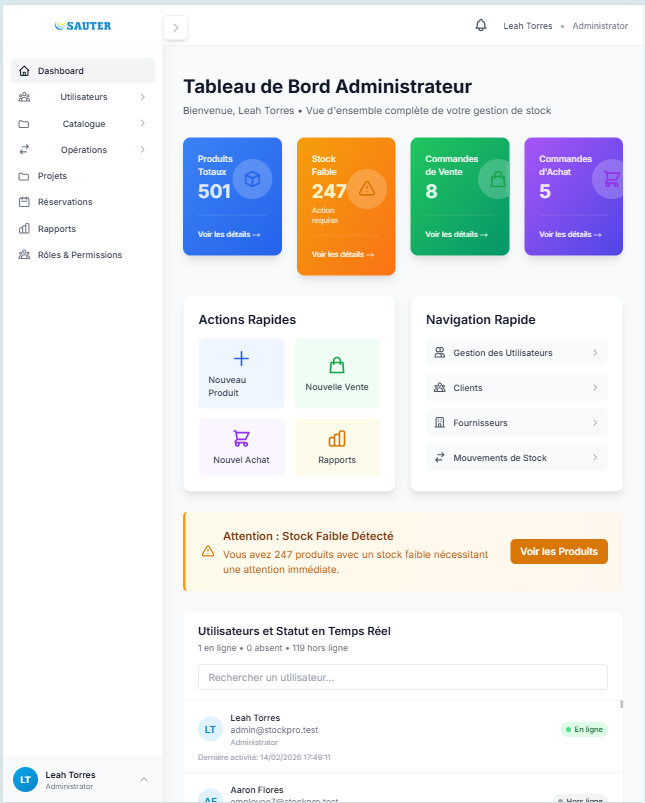 | 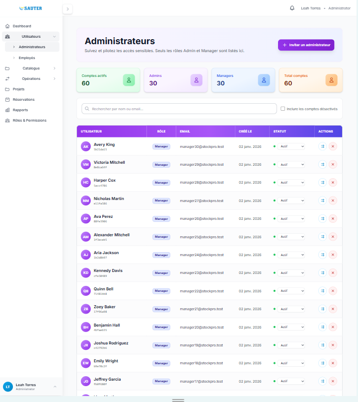 |
| 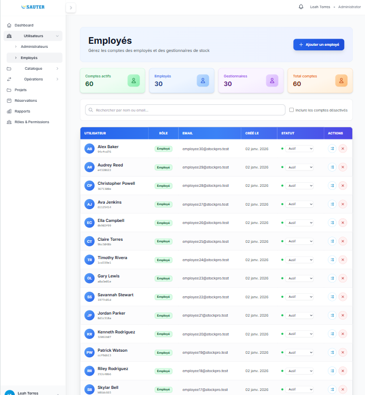 | 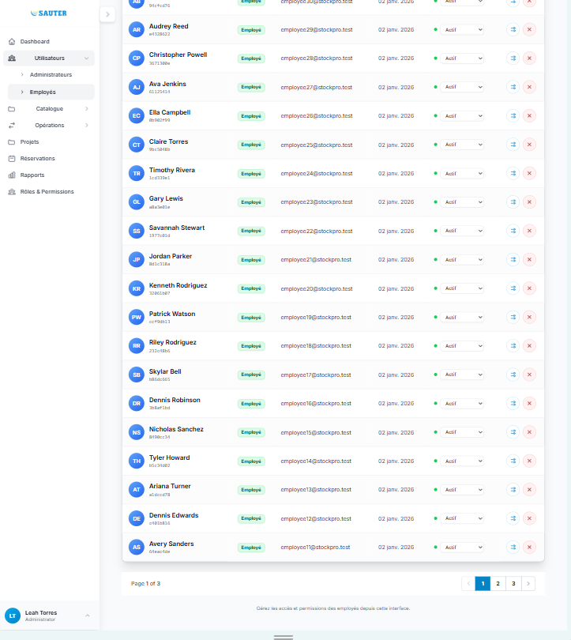 |
| 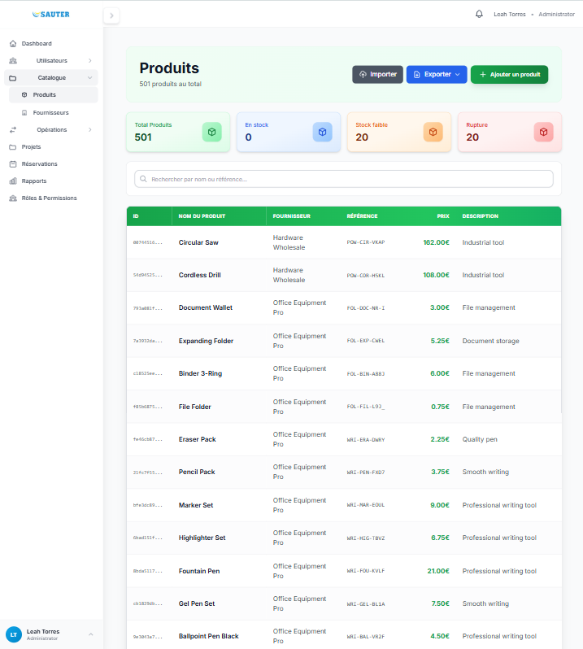 | 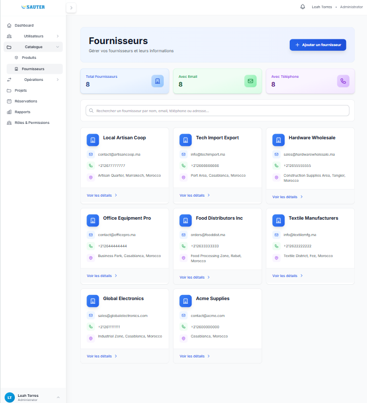 |
| 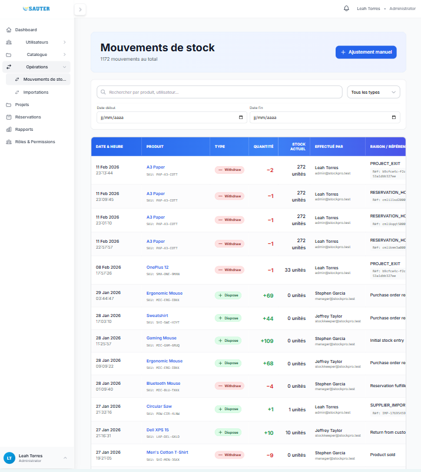 | 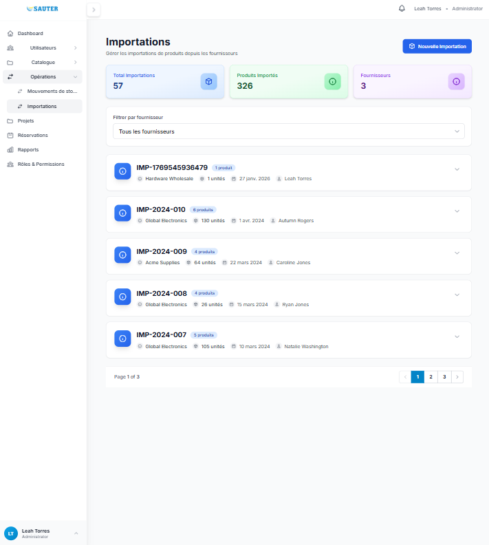 |
| 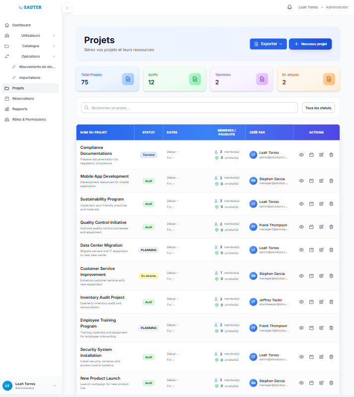 | 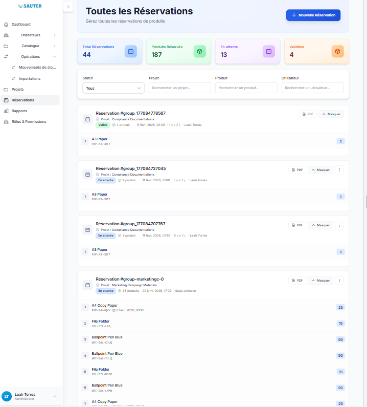 |
| 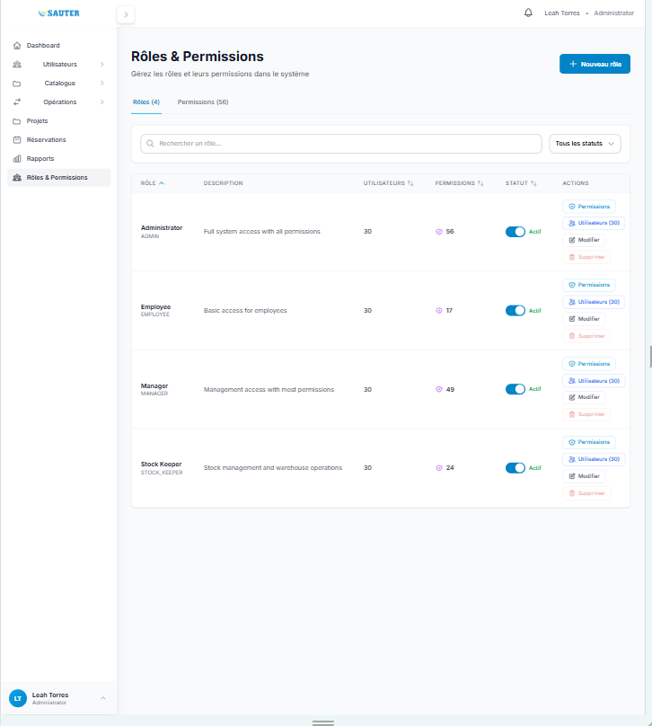 | 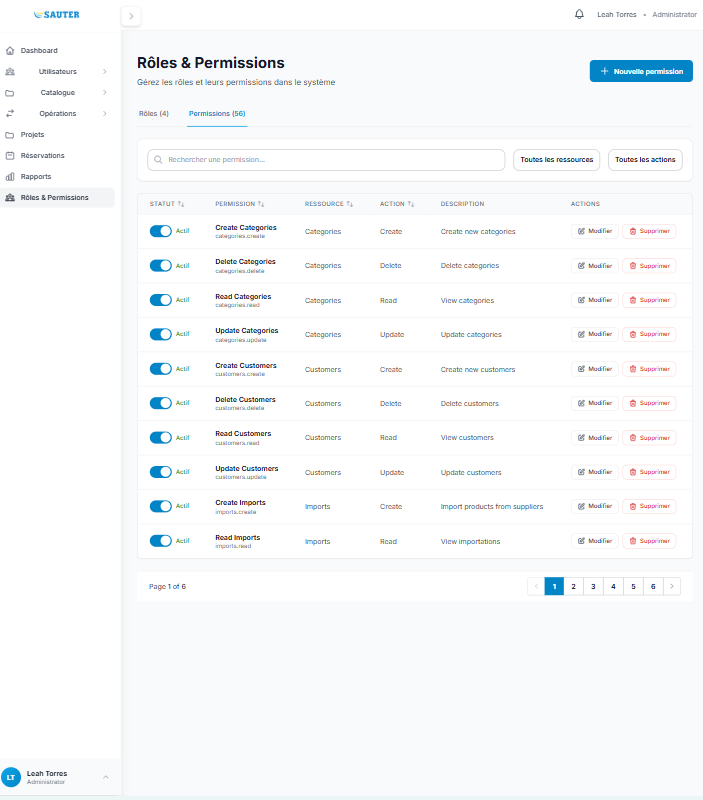 |

*Images du dossier `presentaion/`.*

---

## ✨ Fonctionnalités

### 🎨 Interface
- **Design** : Tailwind CSS, responsive (mobile, tablette, desktop)
- **Composants** : Tables (ModernTable, Table), modals (système ModalContext + NavigationModalContext), toasts, formulaires (React Hook Form + Zod)
- **Chargement** : Skeleton loaders, GlobalLoader, lazy loading images (LazyImage)
- **Upload** : Images multiples avec preview (ImageUpload)

### 📊 Tableaux de bord
- **Dashboard Admin** : statistiques, graphiques (Recharts), alertes stock
- **Dashboard Employé** : vue simplifiée selon rôle
- **Temps réel** : WebSocket (Socket.io) pour notifications et mises à jour

### 📦 Produits & Catalogue
- Liste paginée, recherche et filtres (SearchFilter, SelectFilter), sync URL (useUrlSync)
- CRUD produits (liste, détail, création, édition)
- Upload d'images multiples, affichage stock par entrepôt
- Catégories : CRUD complet

### 🏢 Entrepôts & Stock
- Multi-entrepôts (liste, détail, création, édition)
- Mouvements de stock (liste, filtres), ajustement manuel (ManualStockAdjustmentModal), transferts (StockTransferModal)

### 🛒 Achats & Ventes
- Commandes d'achat : liste, détail, création, workflow (brouillon → validé → reçu), réception (page dédiée), PDF
- Commandes de vente : liste, détail, création, workflow (brouillon → validé → livré), livraison (page dédiée), PDF

### 📋 Réservations & Projets
- Réservations : liste, création (dont depuis un projet), panier (ReservationCartModal), modification/annulation/validation, PDF
- Projets : liste, fiche projet (détail, membres, produits réservés), création réservation depuis projet, **bon de sortie** (ProjectExitSlipModal) pour sortie immédiate sans réservation

### 👥 Fournisseurs & Clients
- **Fournisseurs** : ouverture en modal depuis la navigation (SuppliersModal), pagination, recherche
- **Clients** : liste, détail, création, édition

### 👤 Utilisateurs & Rôles
- **Administrateurs** : page dédiée (/users/admins), pagination, recherche, sync URL
- **Employés** : page dédiée (/users/employees), pagination, recherche, sync URL
- **Rôles** : page gestion des rôles et permissions (/roles, accès admin)

### 🔔 Notifications
- Centre de notifications, badge non lues, marquage comme lu
- Temps réel via WebSocket (RealtimeContext, useNotificationsRealtime)

### 📈 Rapports (admin)
- Valeur inventaire, produits en rupture, meilleurs vendeurs, analytics avec graphiques

### 📦 Importations
- Liste des importations, création (ImportFormModal), association fournisseurs

---

## 🛠 Technologies

| Composant | Technologie |
|-----------|-------------|
| **Framework** | Next.js 14 (App Router) |
| **Langage** | TypeScript 5.4 |
| **UI** | React 18 |
| **Styling** | Tailwind CSS, clsx, tailwind-merge |
| **Formulaires** | react-hook-form + Zod + @hookform/resolvers |
| **Data Fetching** | SWR |
| **HTTP Client** | Axios |
| **Graphiques** | Recharts |
| **Temps réel** | socket.io-client |
| **Icons** | Composants personnalisés (`src/components/icons`) |
| **Date** | date-fns |
| **Export** | xlsx (Excel), csv-utils / excel-utils (lib) |
| **Cookies** | js-cookie |
| **Tests** | Jest + React Testing Library |

---

## 📦 Prérequis

- **Node.js** 20+ et npm
- **Backend API** en cours d'exécution (voir [backend/README.md](../backend/README.md))
- **Docker** (optionnel, pour déploiement)

---

## 🚀 Installation

### 1. Cloner et Installer

```bash
cd frontend
npm install
```

### 2. Configuration de l'Environnement

Créez un fichier `.env.local` :

```env
NEXT_PUBLIC_API_URL=http://localhost:4000
NEXT_PUBLIC_IMAGES_BASE_URL=http://localhost:4000
NEXT_PUBLIC_WS_URL=ws://localhost:4000
```

Les variables `NEXT_PUBLIC_*` sont exposées au client.

### 3. Démarrer le Serveur de Développement

```bash
npm run dev
```

L'application sera disponible sur `http://localhost:3000`

---

## ⚙️ Configuration

### Variables d'Environnement

| Variable | Description | Défaut |
|----------|-------------|--------|
| `NEXT_PUBLIC_API_URL` | URL de l'API backend | `http://localhost:4000` |
| `NEXT_PUBLIC_IMAGES_BASE_URL` | URL de base pour les images uploadées | `NEXT_PUBLIC_API_URL` ou `http://localhost:4000` |
| `NEXT_PUBLIC_WS_URL` | URL WebSocket (optionnel) | - |
| `NEXT_PUBLIC_STORAGE_URL` | URL de stockage média | - |

### Configuration Next.js

Le fichier `next.config.js` inclut :
- **SWC minification** activée
- **Compression Gzip** activée
- **Standalone output** pour Docker
- **Optimisation d'images** (AVIF, WebP)
- **Remote patterns** pour S3

---

## 💻 Développement

### Structure du Projet

```
frontend/
├── src/
│   ├── app/
│   │   ├── layout.tsx              # Layout racine (Providers, LayoutSelector)
│   │   ├── page.tsx                # Page d'accueil (redirection)
│   │   ├── login/page.tsx          # Connexion
│   │   ├── (shared)/               # Routes partagées (avec garde par rôle)
│   │   │   ├── dashboard/          # Tableau de bord (Admin ou Employee selon rôle)
│   │   │   ├── products/           # Liste, [id], new, [id]/edit
│   │   │   ├── categories/         # Liste, new, [id]/edit
│   │   │   ├── warehouses/         # Liste, [id], new, [id]/edit
│   │   │   ├── movements/          # Mouvements de stock
│   │   │   ├── purchases/          # Liste, [id], new, [id]/receive
│   │   │   ├── sales/              # Liste, [id], new, [id]/deliver
│   │   │   ├── suppliers/          # (modal) + pages new, [id], [id]/edit
│   │   │   ├── customers/          # Liste, [id], new, [id]/edit
│   │   │   ├── reservations/       # Liste, new
│   │   │   ├── projects/           # Liste, [id]
│   │   │   ├── imports/            # Liste, new
│   │   │   └── notifications/      # Centre de notifications
│   │   └── (admin)/                # Routes réservées admin / permissions
│   │       ├── users/              # users, admins, employees
│   │       └── reports/            # Rapports
│   ├── components/
│   │   ├── Layout.tsx, MainContent, Sidebar, SidebarNavigation, NavItem
│   │   ├── layouts/                # AdminLayout, EmployeeLayout, LayoutSelector
│   │   ├── sidebars/               # AdminSidebar, EmployeeSidebar
│   │   ├── headers/                # AdminTopHeader, EmployeeTopHeader, TopHeader
│   │   ├── modal/                  # ModalTemplate, ModalContainer, ModalItem
│   │   ├── toast/                  # ToastContainer, ToastItem
│   │   ├── navigation/             # NavigationModalContainer (modals depuis nav)
│   │   ├── ui/                     # ModernTable, PageHeader, SearchFilter, SelectFilter, StatusBadge, etc.
│   │   ├── dashboards/             # AdminDashboard, EmployeeDashboard
│   │   ├── reservations/           # ReservationCartModal, UpdateReservationModal, etc.
│   │   ├── projects/               # ProjectExitSlipModal, AddProjectMemberModal, etc.
│   │   ├── suppliers/              # SuppliersModal
│   │   ├── guards/                 # RouteGuard
│   │   ├── Providers.tsx, ErrorBoundary, ConfirmModal, Pagination, ImageUpload, LazyImage, SkeletonLoader
│   │   └── icons/                 # Icônes personnalisées
│   ├── contexts/                  # AuthContext, ToastContext, ModalContext, NavigationModalContext, LoadingContext, RealtimeContext
│   ├── hooks/                     # useApi, useUrlSync, useRouteGuard, useReservationCart, useToastForm, useErrorHandler, useNotificationsRealtime, useStockAlerts, useMedia, etc.
│   ├── lib/                       # api, auth, utils, pdf, permissions, csv-utils, excel-utils, realtime, images, local-storage
│   └── types/                     # api, shared, modal, toast
├── public/                        # Assets (logo, etc.)
├── presentaion/                   # Captures d'écran pour le README
├── Dockerfile, docker-compose.yml (optionnel)
└── package.json
```

### Scripts NPM

| Commande | Description |
|----------|-------------|
| `npm run dev` | Serveur de développement |
| `npm run build` | Build de production |
| `npm run start` | Serveur de production (après build) |
| `npm run lint` | ESLint |
| `npm run type-check` | Vérification TypeScript (tsc --noEmit) |
| `npm run test` | Tests Jest |
| `npm run test:watch` | Tests en mode watch |
| `npm run test:coverage` | Couverture de tests |
| `npm run test:components` | Tests des composants (Jest) |

### Workflow de Développement

1. **Démarrer le backend** (voir [backend/README.md](../backend/README.md))
2. **Démarrer le frontend** : `npm run dev`
3. **Accéder à l'application** : `http://localhost:3000`
4. **Se connecter** avec les identifiants du backend

---

## 🐳 Déploiement

### Docker Compose

Le projet inclut un `docker-compose.yml` pour déployer le frontend :

```bash
# Démarrer le service
docker-compose up -d

# Voir les logs
docker-compose logs -f frontend

# Arrêter le service
docker-compose down

# Rebuild et redémarrer
docker-compose up -d --build
```

### Docker Seul

```bash
# Build l'image
docker build -t gestion-stock-frontend .

# Run le container
docker run -p 3000:3000 \
  -e NEXT_PUBLIC_API_URL=https://your-backend-url.com \
  gestion-stock-frontend
```

### Production

1. **Variables d'environnement** : Configurez `NEXT_PUBLIC_API_URL` pour pointer vers votre backend
2. **Build** : `npm run build`
3. **Start** : `npm run start` ou utilisez Docker
4. **HTTPS** : Utilisez un reverse proxy (Nginx, Traefik) pour HTTPS

---

## 🔄 Gestion d'État

### SWR pour Data Fetching

Le projet utilise **SWR** pour la récupération et la mise en cache des données :

```typescript
import { useApi } from '@/hooks/useApi';

// Fetch data
const { data, loading, error } = useApi<Product[]>('/products');

// Mutations
const { mutate } = useApiMutation();
await mutate('/products', 'POST', newProduct);
```

### Contextes React

| Contexte | Rôle |
|----------|------|
| **AuthContext** | Utilisateur connecté, login, logout, refresh token |
| **ToastContext** | Notifications toast (success, error, info) |
| **ModalContext** | Ouverture/fermeture des modals génériques |
| **NavigationModalContext** | Ouverture des modals depuis la navigation (ex. fournisseurs) |
| **LoadingContext** | État de chargement global (GlobalLoader) |
| **RealtimeContext** | Connexion WebSocket (notifications, présence) |

### Exemple

```typescript
import { useAuth } from '@/contexts/AuthContext';
import { useToast } from '@/contexts/ToastContext';

function MyComponent() {
  const { user, logout } = useAuth();
  const toast = useToast();
  const handleAction = async () => {
    try {
      // ...
      toast.success('Action réussie !');
    } catch (error) {
      toast.error('Erreur');
    }
  };
}
```

---

## 🔐 Authentification

### Flow d'Authentification

1. **Login** : L'utilisateur se connecte via `/login`
2. **Tokens** : Le backend retourne un access token et un refresh token (cookie HTTP-only)
3. **Storage** : L'access token est stocké en mémoire (pas dans localStorage)
4. **Refresh** : Le refresh token est automatiquement utilisé pour renouveler l'access token
5. **Logout** : Nettoyage des tokens et redirection

### Protection des routes

- **RouteGuard** (`components/guards/RouteGuard`) : affiche les enfants si l'utilisateur a les rôles/permissions requis, sinon redirection ou fallback.
- **useRouteGuard** : hook pour vérifier l'accès (rôles, permissions) et décider de la redirection.
- Les routes sont organisées en groupes `(admin)` et `(shared)` ; le layout (AdminLayout / EmployeeLayout) et la navigation (navigationConfig) filtrent les liens selon les permissions.

---

## 🎨 Composants principaux

- **Layout** : Layout principal avec Sidebar (AdminSidebar / EmployeeSidebar selon rôle), TopHeader, Notifications.
- **LayoutSelector** : Choisit AdminLayout ou EmployeeLayout selon l'utilisateur.
- **ModernTable** : Tableau avec colonnes configurables, tri, pagination (voir `components/ui`).
- **PageHeader** : En-tête de page avec titre et bouton d'action optionnel.
- **SearchFilter / SelectFilter** : Filtres de liste (recherche, select) avec sync URL possible.
- **Modal** : ModalTemplate, ModalContainer ; modals métier (ConfirmModal, ProductFormModal, ReservationCartModal, SuppliersModal, ProjectExitSlipModal, etc.).
- **Pagination** : `currentPage`, `totalPages`, `onPageChange`, `hasNext`, `hasPrev`.
- **ImageUpload** : Images multiples, preview, `value` / `onChange` / `maxFiles`.
- **SkeletonLoader** : TableSkeleton, CardSkeleton pour états de chargement.
- **RouteGuard** : Protection des pages par authentification et permissions (voir `components/guards`).
- **ErrorBoundary** : Capture des erreurs React et affichage d'un fallback.

---

## 🧪 Tests

- **Jest** + **React Testing Library** ; configuration dans le projet.
- **Lancer** : `npm run test` ; `npm run test:watch` ; `npm run test:coverage` ; `npm run test:components`.
- **Exemples de tests présents** : `Pagination`, `SidebarOverlay`, `SkeletonLoader`, `ModernTable` (voir `src/components/__tests__/` et `src/components/ui/__tests__/`).

---

## 🛠 Troubleshooting

### Problèmes CORS

Vérifiez que `NEXT_PUBLIC_API_URL` correspond à l'URL du backend et que le backend autorise cette origine dans `FRONTEND_URL`.

### Erreurs d'Authentification

- Vérifiez que le backend est démarré
- Vérifiez que les cookies sont activés dans le navigateur
- Vérifiez les tokens dans les DevTools (Network tab)

### Problèmes de Build

```bash
# Nettoyer et rebuilder
rm -rf .next node_modules
npm install
npm run build
```

### Images Non Chargées

- Vérifiez que `next.config.js` inclut les domaines d'images
- Vérifiez les permissions des fichiers uploadés
- Vérifiez que `NEXT_PUBLIC_API_URL` est correct

---

## 📖 Ressources

- [Documentation Next.js](https://nextjs.org/docs) · [React](https://react.dev/) · [Tailwind CSS](https://tailwindcss.com/docs) · [SWR](https://swr.vercel.app/) · [React Hook Form](https://react-hook-form.com/)

---

## 📝 License

Ce projet fait partie de **Gestion de Stock Pro**.

---

**Dernière mise à jour du README :** Février 2025 — aligné avec la structure et les fonctionnalités actuelles du frontend.
